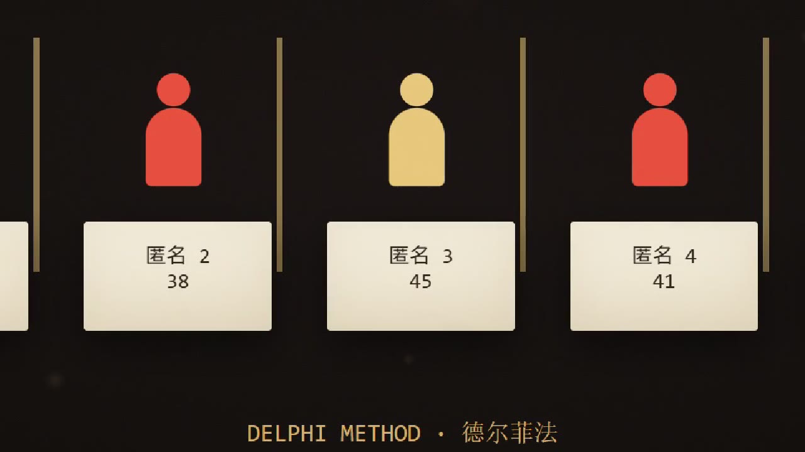
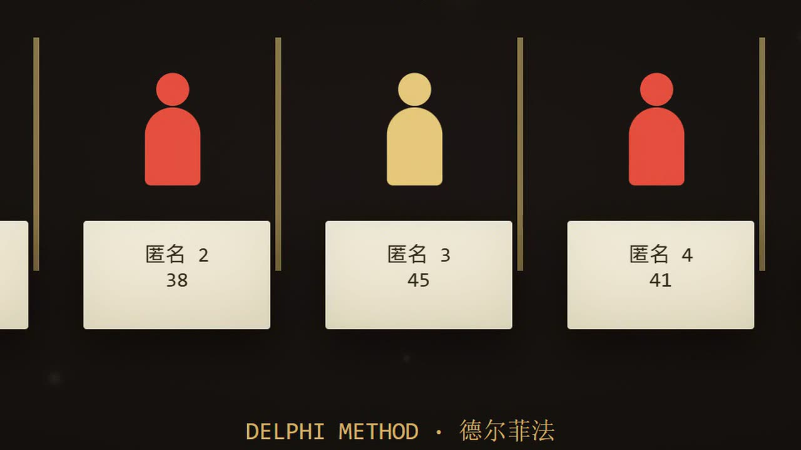

# video-upscale-cpu 🎞️

**动效图 / 信息图 / 2D 动画视频补分辨率——纯 CPU ffmpeg 修复链，零显存、零下载、免 AI。**

一条实测验证的链：`deband`（去黑底色带）→ `hqdn3d`（去压缩噪）→ `lanczos` 放大到 2560×1440 → `CAS 0.6`（锐化文字与图形边缘）。161 秒 1080p 素材几分钟跑完，输出 2K crf15，音轨原样不动。

## 前后对比（1:1 像素，同源画面）

| Before（1080p 直接放大） | After（本链） |
|---|---|
|  |  |

小字笔画、图形边缘、暗部色带三处都有可见净增益；量化口径见下。

## 快速开始

依赖：**ffmpeg/ffprobe** 在 PATH（[官网下载](https://ffmpeg.org/download.html) 或 `winget install Gyan.FFmpeg`）；`Pillow + numpy` 可选（只影响自动验收对比图）。

```bash
python scripts/upscale2k.py 源视频.mp4           # 输出 源视频_2k.mp4
python scripts/upscale2k.py 源视频.mp4 输出.mp4  # 指定输出
```

脚本会自动：探源 → 跑链 → 完整性校验（时长对齐 / 音轨起点）→ 生成同帧 1:1 前后对比图 + 边缘能量比报告。

## 这条链适合什么

✅ **对口**：动效信息图、扁平图形动画、黑底文字卡片、PPT 式演示录屏、2D 动画——它们的病灶是**黑底渐变色带**和**被压缩糊掉的小字边缘**，deband+lanczos+CAS 正面解决。

⚠️ **次优**：实拍真人素材——实拍的增益在重建皮肤/毛发/布料纹理，那该走 AI 超分（RealESRGAN 等），本链虽能跑但不是最优解。脚本探源后会提醒。

## 🔴 三条硬坑（每条都实撞过，写进脚本自动规避）

1. **`lanczos` 不是独立 ffmpeg 滤镜**——必须写 `scale=2560:1440:flags=lanczos`，写 `lanczos=2560:1440` 直接 Invalid argument。
2. **mp4 的 moov 索引转码结束才写入**——跑一半打开输出必报 "Invalid data / 无法打开"，不是坏了，等跑完。
3. **二手转码版不可作源**——QQ/微信转码会抽帧（实测 4842→4830 帧）+时间戳损伤，拿它的视频轨配原版音轨 = 音画错位（前几秒没声）。错位排查命令见 SKILL.md。

## 作为 Agent Skill 使用

仓库自带 Agent Skill 封装（`skills/`、`.claude/skills/`、`.agents/skills/`、`.opencode/skills/` 四份同内容），Claude Code / OpenCode / Qoder 等支持 skills 的环境可直接安装，对话里说"帮我补分辨率/升 2K"即可触发。

## 参数微调

| 症状 | 调整 |
|---|---|
| 小字过锐、白边 | `cas=0.6` → `0.4` |
| 黑底色带残留 | deband 已在链首，可再叠一次或调其阈值 |
| 压缩噪点重 | `hqdn3d=1.5:1.5:6:6` 前两位升到 2 |

## 验收口径（建议跑完自查）

- 同帧 1:1 像素对比（脚本自动生成 `*.cmp_old.jpg` / `*.cmp_new.jpg`）：边缘能量比（新/旧）**1.05~1.15** 为正常增益；低于 1.0 = 链子起反作用。
- 音轨：`ffprobe` 音频流 `start_time=0`，开头 3 秒 volumedetect 有响度。

## License

MIT
